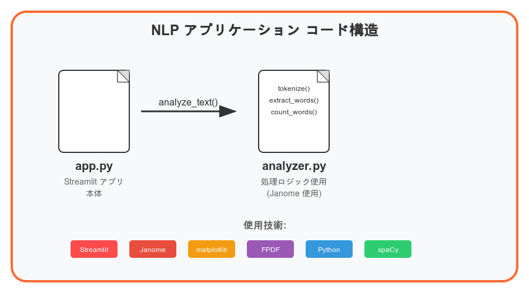

# 日本語テキスト解析くん（Streamlitアプリ）

## アプリの説明
ユーザーが入力した日本語テキストやアップロードした.txtファイルを解析し、単語の出現回数や名詞／動詞の分布などを表示します。

## 使用API（ライブラリ）
- Janome（日本語形態素解析）

## 機能
- 入力欄からテキストを直接入力
- .txtファイルをアップロードして解析
- 単語の出現回数ランキング表示
- 名詞／動詞の出現数表示
- 総文字数・単語数・文数の統計

<!-- ## デプロイURL
- アプリURL：https://22030015nakamuraaiprograming2assignment-xliehkfejmosesk8t4wbsw.streamlit.app/ 
- GitHub URL：https://github.com/Kyohei33/22030015_nakamura_AIPrograming2assignment.git -->

## システム設計図

## コード構造図

